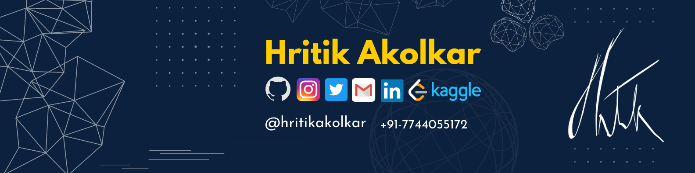

### Hi there 👋 I'M HRITIK AKOLKAR.
- 🔭 I’m currently working on Machine Learning and a Kaggle 1X Expert.  
- 🌱 I’m currently learning Natural Language Processing.
- 👯 I’m looking to collaborate on any AI platform.
- 💬 Ask me about Data Science and Conversational AI.
- 📫 Reach me through : <a href="https://www.linkedin.com/in/hritikakolkar/" target="_blank">Linkedin</a> | <a href="mailto:hritikakolkar@gmail.com" target="_blank">Email</a>
- 🔎 Online Presence : <a href="https://www.hackerrank.com/hritikakolkar/" target="_blank">HackerRank</a> |  <a href="https://www.kaggle.com/hritikakolkar/" target="_blank">Kaggle</a>  |  <a href="https://leetcode.com/hritikakolkar/" target="_blank">Leetcode</a>

### Short Courses
#### MlOps
  - Weight and Biases
    - [Getting Started W&B 101](https://www.wandb.courses/courses/wandb-101)
    - [W&B 201: Model Registry](https://www.wandb.courses/courses/201-model-registry)
    - [Evaluating and Debugging Generative AI Models Using Weights and Biases](https://www.deeplearning.ai/short-courses/evaluating-debugging-generative-ai/)
#### LLMs
  - ChatGPT
    - [ChatGPT Prompt Engineering for Developers](https://www.deeplearning.ai/short-courses/chatgpt-prompt-engineering-for-developers/)
    - [Building Systems with the ChatGPT API](https://www.deeplearning.ai/short-courses/building-systems-with-chatgpt/)
  - LangChain
    - [LangChain for LLM Application Development](https://www.deeplearning.ai/short-courses/langchain-for-llm-application-development/)
    - [LangChain: Chat with Your Data](https://www.deeplearning.ai/short-courses/langchain-chat-with-your-data/)
    - [Functions, Tools and Agents with LangChain](https://www.deeplearning.ai/short-courses/functions-tools-agents-langchain/)
  - Weight and Biases
    - [Building LLM-Powered Apps](https://www.wandb.courses/courses/building-llm-powered-apps)
    - [Training and Fine-tuning Large Language Models (LLMs)](https://www.wandb.courses/courses/training-fine-tuning-LLMs)
  - General
    - [Finetuning Large Language Models](https://www.deeplearning.ai/short-courses/finetuning-large-language-models/)
    - [Large Language Models with Semantic Search](https://www.deeplearning.ai/short-courses/large-language-models-semantic-search/)
    - [Building and Evaluating Advanced RAG Applications](https://www.deeplearning.ai/short-courses/building-evaluating-advanced-rag/)
    - [Quality and Safety for LLM Applications](https://www.deeplearning.ai/short-courses/quality-safety-llm-applications/)
    - [Pair Programming with a Large Language Model](https://www.deeplearning.ai/short-courses/pair-programming-llm/)
### Talks, Meetups and Conference
- 2023
  - November
    + Attended *Open-Source GenAI Meetup by Lightning AI (PyTorch Lightning)*
